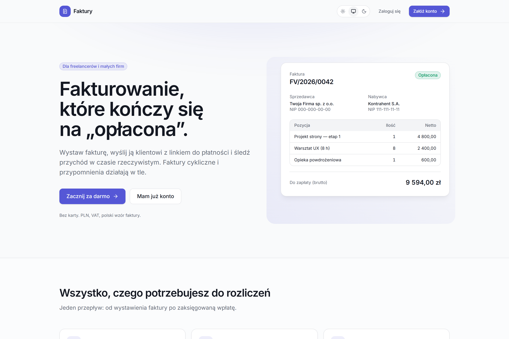
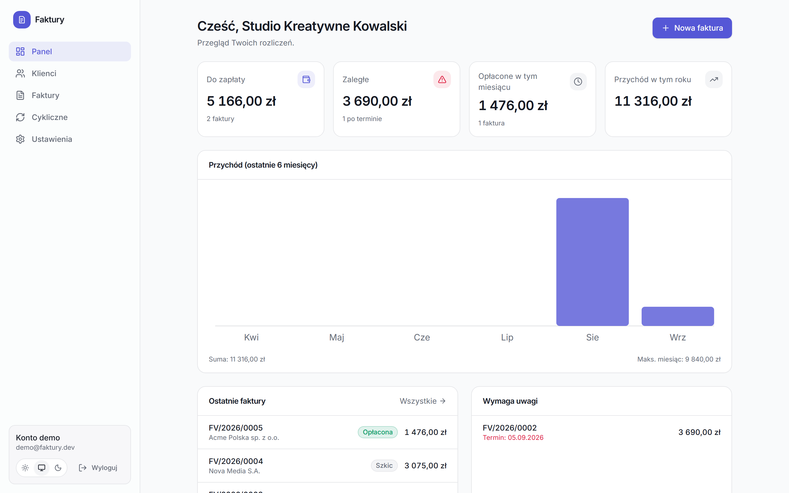
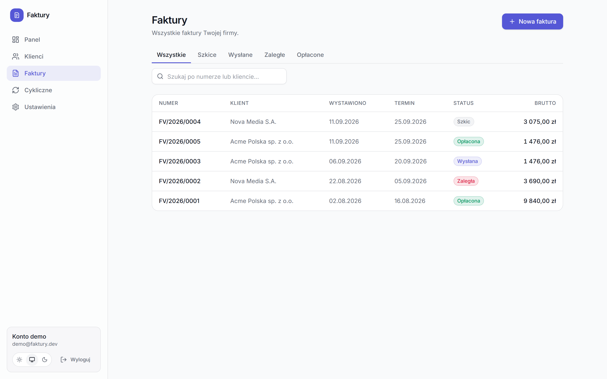
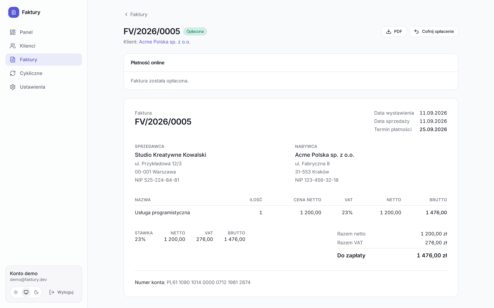
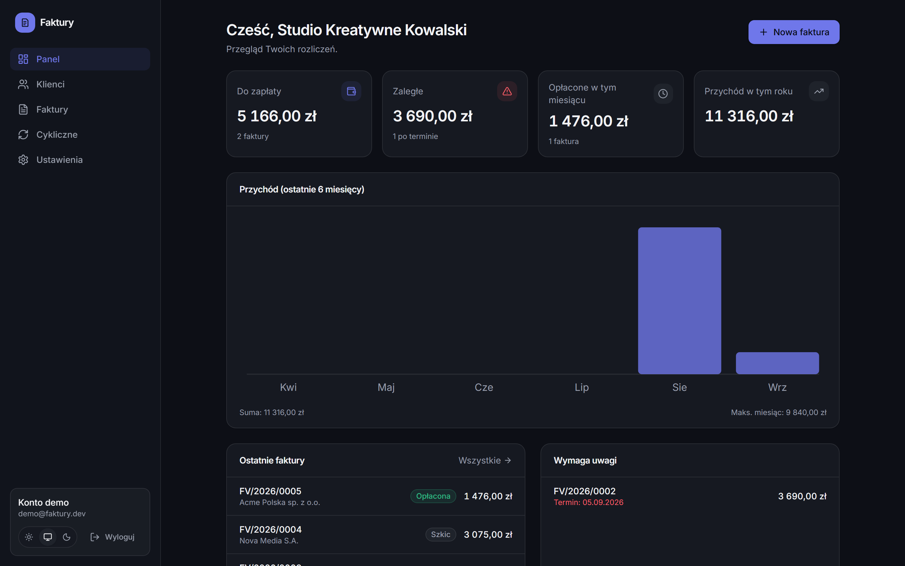

# Faktury

[](https://github.com/Dnapieraj/faktury/actions/workflows/ci.yml)

Aplikacja do fakturowania dla freelancerów i małych firm. Każdy użytkownik = jedna firma
z własnymi klientami i fakturami (pełna izolacja danych po `userId`).

**Przepływ:** wystawiasz fakturę → generuje się PDF → mail do klienta z linkiem do płatności
Stripe → klient płaci → webhook `checkout.session.completed` → status „opłacona” → potwierdzenie
do właściciela. Do tego faktury cykliczne (co miesiąc) i codzienne oznaczanie zaległości +
przypomnienia — wszystko na Vercel Cron.

### 🔗 [faktury-phi.vercel.app](https://faktury-phi.vercel.app)

Konto demo — nie trzeba się rejestrować:

```
e-mail:  demo@faktury.dev
hasło:   demo12345
```

Zawiera przykładowych klientów i faktury w różnych statusach (szkic, wysłana, zaległa,
opłacona), więc dashboard i wykres przychodu od razu pokazują realne dane.

## Zrzuty ekranu

| Landing | Panel |
| --- | --- |
|  |  |

| Lista faktur | Widok faktury |
| --- | --- |
|  |  |

<details>
<summary>Tryb ciemny</summary>



</details>

## Stack

Next.js 16 (App Router, RSC, Server Actions, Turbopack) · TypeScript · Prisma 7 + PostgreSQL
(Neon) · Auth.js v5 (e-mail/hasło + Google) · Tailwind CSS v4 · Stripe (Checkout + webhooki) ·
Resend + react-email · `@react-pdf/renderer` · Vercel Cron · Vitest + Playwright + GitHub Actions.

## Funkcje

- **Klienci** — nazwa, NIP (z walidacją sumy kontrolnej), adres, e-mail; archiwizacja
- **Faktury** — automatyczny numer `FV/RRRR/NNNN`, pozycje z VAT (23/8/5/0%), zestawienie
  stawek VAT, terminy, statusy `szkic → wysłana → opłacona / zaległa`, snapshot nabywcy
- **PDF** — polski wzór faktury A4, czcionka z polskimi znakami, pobieranie i załącznik do maila
- **Płatności** — link Stripe Checkout (PLN, BLIK/karta), publiczna strona `/pay/[id]`, webhook
- **Maile** — wysłana faktura (+PDF), potwierdzenie płatności, przypomnienie o zaległości
- **Faktury cykliczne** — szablon → co miesiąc automatyczne wystawienie i wysyłka
- **Cron** — codzienne oznaczanie faktur po terminie jako „zaległe” + przypomnienia
- **Dashboard** — przychód w czasie (wykres), kwoty do zapłaty, zaległości, ostatnie faktury
- **Ustawienia** — dane firmy (sprzedawca), numer konta IBAN, domyślny prefiks / termin / VAT

## Uruchomienie lokalne

Wymagania: Node 24 (`.nvmrc`). Baza lokalna to `prisma dev` — bez Dockera.

```bash
cp .env.example .env          # uzupełnij AUTH_SECRET:  npx auth secret
npm install
npm run db:up                 # lokalny Postgres (zostaw w osobnym terminalu)
npm run db:migrate            # migracje + generacja klienta Prisma
npm run db:seed               # konto demo:  demo@faktury.dev / demo12345
npm run dev                   # http://localhost:3000
```

Stripe / Resend / Google są opcjonalne lokalnie — bez kluczy te ścieżki po prostu się pomijają
(patrz `.env.example`). Do testów webhooka Stripe: `stripe listen --forward-to
localhost:3000/api/stripe/webhook` i wklej `whsec_...` do `STRIPE_WEBHOOK_SECRET`.

Jeśli `prisma dev` wypisze inne porty niż w `.env.example`, sprawdź je przez `npx prisma dev ls`.

## Skrypty

|                                                                                   |                                                                  |
| --------------------------------------------------------------------------------- | ---------------------------------------------------------------- |
| `npm run dev` / `build` / `start`                                                 | Next.js                                                          |
| `npm test` / `test:watch`                                                         | Vitest (logika: kwoty, VAT, NIP, IBAN, daty cykliczne, schematy) |
| `npm run test:e2e`                                                                | Playwright (wymaga działającej bazy; w CI na realnym Postgresie) |
| `npm run typecheck` / `lint` / `format`                                           | tsc / ESLint / Prettier                                          |
| `npm run db:up` / `db:down` / `db:migrate` / `db:reset` / `db:studio` / `db:seed` | Prisma                                                           |

## Struktura

```
app/(marketing)  app/page.tsx        landing
app/(auth)       login / register / onboarding
app/(app)        dashboard / clients / invoices / recurring / settings   (chronione przez proxy.ts)
app/pay/[id]     publiczna strona płatności
app/api          auth · stripe/webhook · cron/{overdue,recurring}
lib/             prisma, auth, walidacje (Zod), logika faktur/VAT/dat, PDF, maile, Stripe, cron
components/ui    design system (Button, Input, Card, Table, Dialog, …)
prisma/          schema + migracje + seed
```

## Wdrożenie

Zobacz [`DEPLOYMENT.md`](./DEPLOYMENT.md) — Vercel + Neon, zmienne środowiskowe, webhooki, cron.

## Status roadmapy

- [x] Schemat Prisma + design system + landing
- [x] Auth.js (e-mail/hasło + Google) + ochrona tras
- [x] CRUD klientów i faktur (numeracja, VAT, statusy)
- [x] Generowanie PDF
- [x] Stripe Checkout + webhooki
- [x] Maile transakcyjne (Resend)
- [x] Faktury cykliczne + przypomnienia (Vercel Cron)
- [x] Dashboard z wykresem przychodu
- [x] Testy (Vitest + Playwright) + GitHub Actions

## O projekcie

Trzeci projekt portfolio (po systemie rezerwacji dla warsztatu samochodowego i systemie do
zarządzania magazynem), zbudowany żeby pogłębić ten sam stack o integracje, które pojawiają
się w prawdziwych produktach SaaS: płatności i webhooki, maile transakcyjne, generowanie PDF
i zadania cykliczne (cron). Cały przepływ — od wystawienia faktury po zaksięgowaną wpłatę —
działa end-to-end na produkcji, nie tylko lokalnie.

> Aplikacja do fakturowania (Next.js 16, Prisma, Postgres, Stripe, Resend) z pełnym
> przepływem płatności online: faktura → PDF → e-mail z linkiem do płatności → webhook →
> automatyczne potwierdzenie. Faktury cykliczne i przypomnienia o zaległościach na cronie.

---

Projekt portfolio · zbudowany przez [dnapieraj](https://github.com/dnapieraj).
